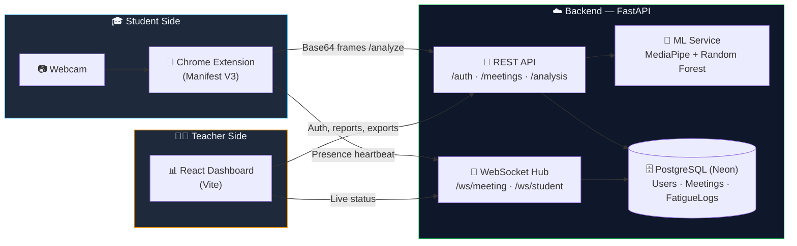
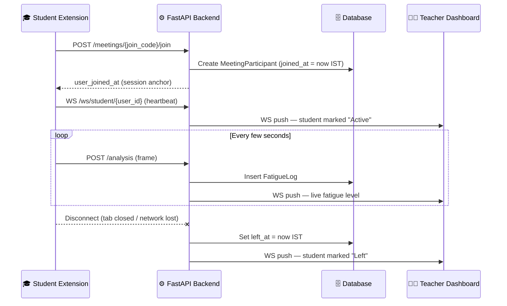
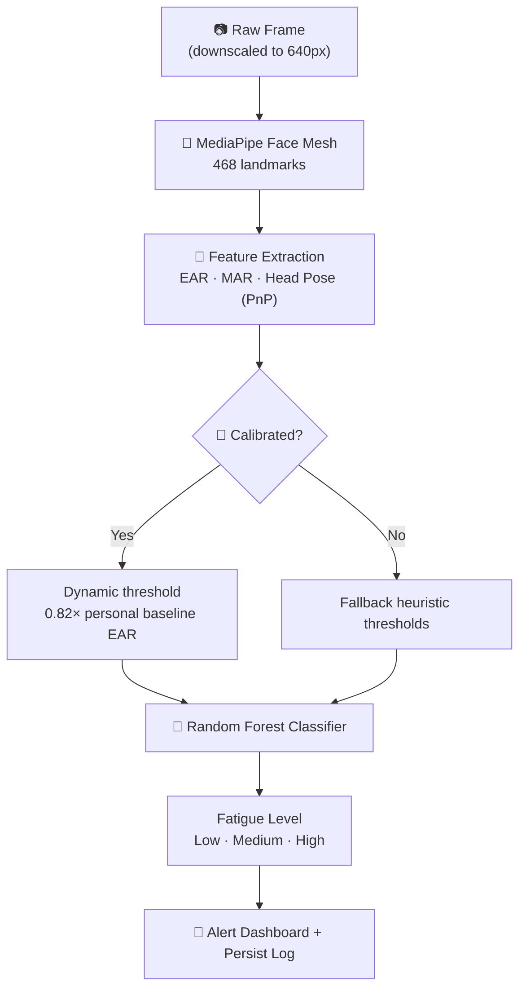
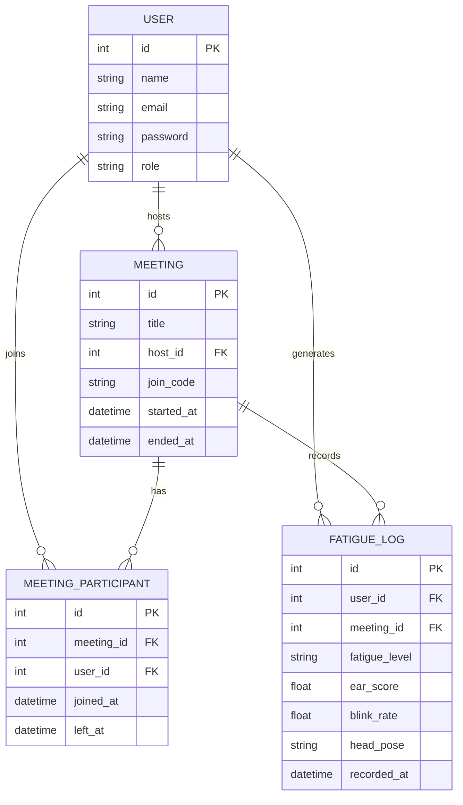

<div align="center">


# 🛡️ Fatigue Monitoring System

### AI-powered real-time fatigue &amp; engagement detection for virtual classrooms

<p>
  
  
  
</p>
<p>
  
  
  
  
  
  
  
</p>

</div>

---

## 📖 Table of Contents

- [Overview](#-overview)
- [Key Features](#-key-features)
- [System Architecture](#-system-architecture)
- [Data Flow](#-data-flow)
- [Data Model](#-data-model)
- [Tech Stack](#-tech-stack)
- [Project Structure](#-project-structure)
- [Getting Started](#-getting-started)
- [API Reference](#-api-reference)
- [Testing](#-testing)
- [Deployment](#-deployment)
- [License](#-license)

---

## 🚀 Overview

The **Fatigue Monitoring System** gives teachers real-time visibility into student well-being during virtual classes. A lightweight Chrome extension watches each student's webcam feed on-device, extracts facial landmarks, and streams engagement signals to a FastAPI backend — which fuses them into a live fatigue score a teacher can act on, without ever storing raw video.

By analyzing **Eye Aspect Ratio (EAR)**, **Mouth Aspect Ratio (MAR)**, blink rate, and head pose, the system flags drowsiness and distraction as they happen — not after the class is over.

---

## ✨ Key Features

| | Feature | Description |
|---|---|---|
| 🧠 | **ML-Powered Detection** | MediaPipe Face Mesh (468 landmarks) + a Random Forest classifier turn raw geometry into a live fatigue level. |
| 🌍 | **IST Standardization** | Database, logs, and UI are fully synchronized to **India Standard Time** — no UTC drift anywhere in the stack. |
| ⏱️ | **Per-Student Session Timer** | The extension timer starts at exactly `00:00:00` from the moment *that student* joins — not the meeting's age. |
| 📡 | **Automated Presence Tracking** | A WebSocket heartbeat marks students "Left" the instant they disconnect, even on a hard browser close. |
| 🔁 | **Multi-Session Support** | Students can join/leave the same meeting multiple times; total time is tracked cumulatively. |
| 🎯 | **Personal Calibration** | A 5-second calibration step sets a per-student EAR baseline, so thresholds adapt to each face instead of a fixed global cutoff. |
| 🔐 | **JWT Auth & Roles** | Teacher and Student roles are enforced end-to-end via signed tokens with 24-hour expiry. |
| 🩺 | **Privacy by Design** | Frames are analyzed and discarded — only derived metrics (EAR, MAR, pose, fatigue level) are ever persisted. |

---

## 🏗️ System Architecture



---

## 🔄 Data Flow

### 1. Attendance & Presence Loop



### 2. ML Prediction Pipeline



---

## 🗃️ Data Model



---

## 🛠️ Tech Stack

<div align="center">

| Layer | Technologies |
|---|---|
| **Extension** | Manifest V3 · Vanilla JS · MediaPipe (WASM) · Offscreen Documents |
| **Backend** | FastAPI · SQLAlchemy · Pydantic · python-jose (JWT) · passlib (bcrypt) |
| **ML / Vision** | MediaPipe Face Mesh · OpenCV · Scikit-learn (Random Forest) · NumPy |
| **Dashboard** | React 19 · Vite · WebSocket client · Context API |
| **Database** | PostgreSQL via **Neon** (SSL + connection pooling), SQLite for local dev |
| **Realtime** | Native WebSockets (`/ws/meeting/{id}`, `/ws/student/{id}`) |

</div>

---

## 📂 Project Structure

```text
fatigue-monitoring-system/
├── backend/                    # FastAPI application
│   ├── app/
│   │   ├── auth/               # Register, login, JWT, role guards
│   │   ├── meetings/           # Meetings, participants, attendance, fatigue logs
│   │   ├── analysis/           # /analyze + /calibrate ML endpoints
│   │   ├── websockets/         # Live presence & status channels
│   │   ├── database/           # SQLAlchemy models & session
│   │   ├── services/           # ML inference & business logic
│   │   └── core/               # Config, security, IST time utilities
│   └── requirements.txt
├── dashboard/                   # React + Vite (Teacher & Student portals)
│   └── src/
│       ├── pages/               # Login, TeacherPortal, StudentPortal
│       ├── components/          # Shared UI
│       ├── context/              # Auth context
│       └── hooks/                # WebSocket / data hooks
├── extension/                    # Chrome Extension (Manifest V3)
│   ├── background.js             # Service worker — API & WS orchestration
│   ├── offscreen.js               # Webcam capture + frame pipeline
│   ├── sandbox.js                 # MediaPipe inference sandbox
│   └── popup.{html,js,css}         # Extension UI
├── model/                          # Pre-trained Scikit-learn model (v1.pkl)
├── notebooks/                       # Model testing scripts
├── SYSTEM_ARCHITECTURE.md            # Deep technical breakdown
└── TEST_CHECKLIST.md                 # Pre-deployment verification guide
```

---

## ⚡ Getting Started

### 1️⃣ Backend (FastAPI)
```bash
cd backend
python -m venv venv
source venv/bin/activate        # Windows: venv\Scripts\activate
pip install -r requirements.txt
cp .env.example .env            # then fill in DATABASE_URL & SECRET_KEY
uvicorn app.main:app --reload
```

### 2️⃣ Dashboard (React + Vite)
```bash
cd dashboard
npm install
cp .env.example .env             # set VITE_API_URL
npm run dev
```

### 3️⃣ Chrome Extension
1. Visit `chrome://extensions/`
2. Enable **Developer Mode**
3. Click **Load unpacked** → select the `extension/` folder
4. Pin the extension and join a meeting created from the Teacher Portal

---

## 📡 API Reference

### Auth
| Method | Endpoint | Description |
|---|---|---|
| `POST` | `/auth/register` | Create a new user (Teacher or Student) |
| `POST` | `/auth/login` | Authenticate and receive a JWT |
| `GET` | `/auth/me` | Get the current authenticated user |

### Meetings & Attendance
| Method | Endpoint | Description |
|---|---|---|
| `POST` | `/meetings/` | Create a meeting (Teacher) |
| `POST` | `/meetings/{join_code}/join` | Join a meeting via its code |
| `GET` | `/meetings/` | List meetings |
| `GET` | `/meetings/{meeting_id}` | Get meeting details |
| `POST` | `/meetings/{meeting_id}/end` | End a meeting |
| `POST` | `/meetings/{meeting_id}/leave` | Leave a meeting |
| `GET` | `/meetings/{meeting_id}/attendance` | Full attendance list |
| `GET` | `/meetings/{meeting_id}/active-count` | Live count of active students |

### Fatigue Analytics
| Method | Endpoint | Description |
|---|---|---|
| `POST` | `/analysis/` | Submit a frame for fatigue inference |
| `POST` | `/analysis/calibrate` | Run personal EAR baseline calibration |
| `POST` | `/meetings/fatigue/log` | Persist a fatigue log entry |
| `GET` | `/meetings/{meeting_id}/fatigue` | Fatigue logs for a meeting |
| `GET` | `/meetings/{meeting_id}/fatigue/{user_id}` | Fatigue logs for one student |

### Realtime
| Channel | Description |
|---|---|
| `WS /ws/meeting/{meeting_id}` | Teacher dashboard — live per-student status |
| `WS /ws/student/{user_id}` | Extension presence heartbeat |

---

## 🧪 Testing

A full pre-deployment checklist — timer accuracy, presence tracking, calibration sanity, and CORS/production checks — lives in **[`TEST_CHECKLIST.md`](./TEST_CHECKLIST.md)**.

---

## 📊 Deployment

The system is deployment-ready for **Neon (PostgreSQL)** — just point `DATABASE_URL` at your Neon connection string. SSL and connection pooling are already configured in the SQLAlchemy engine, so no extra setup is required beyond the environment variable.

For the deep technical breakdown of every component and protocol, see **[`SYSTEM_ARCHITECTURE.md`](./SYSTEM_ARCHITECTURE.md)**.

---

## 🔒 License

Licensed under the **Apache License 2.0** — see [`LICENSE`](./LICENSE) for details.

<div align="center">

Made with 🧠 + ☕ to help teachers catch burnout before it happens.

</div>